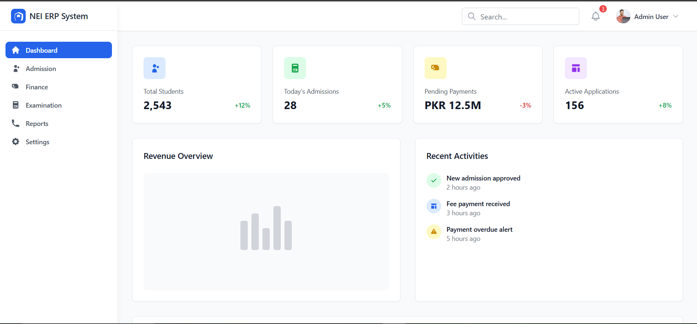

# NEI-ERP-System Admin Dashboard

A modern, responsive Admin Dashboard built with **React.js**, **Tailwind CSS**, and **Lucide Icons**. This project serves as the admin panel for NEI-ERP, managing student admissions, payments, applications, and analytics with a clean and intuitive UI.

## 🚀 Features

- Responsive sidebar with toggle for mobile view
- Dashboard cards with live stats (Students, Admissions, Payments, Applications)
- Notification icon with counter badge
- User profile dropdown with sign-out
- Search bar for quick access
- Analytics section with Revenue Overview and Activity Feed
- Built with Tailwind CSS for rapid and clean styling
- Modern icons via Lucide
- Modular and scalable component structure

## 📸 Preview



## 🧱 Tech Stack

- ⚛️ **React.js**
- 🎨 **Tailwind CSS**
- 🧭 **Lucide-react** (icon library)
- ⚡ **Vite** (recommended for fast development)
- 🧩 React Router DOM (for routing – recommended for future scalability)

## 📂 Folder Structure
src/
├── components/
│ └── Dashboard.jsx
├── assets/
│ └── logo.png
├── App.jsx
└── main.jsx


## 🛠️ Installation

### 1. Clone the Repository

```bash
git clone https://github.com/your-username/nei-erp-dashboard.git
cd nei-erp-dashboard

2. Install Dependencies
npm install

3. Start Development Server
npm run dev

Open http://localhost:5173 in your browser.

